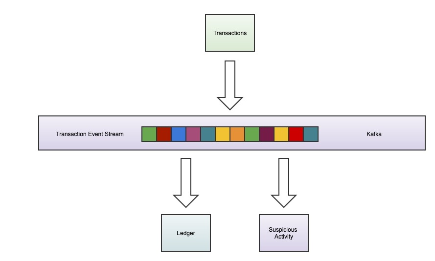

# Account Balance

## Diagram

## Create Kafka Topic
~~~~
Chriss-MacBook-Pro:transactions cgianelle$ docker container exec -it account_balance_kafka_1 bash
I have no name!@f27734a70b00:/$ cd opt/bitnami/kafka/
I have no name!@f27734a70b00:/opt/bitnami/kafka$ bin/kafka-topics.sh --create --topic transactions --bootstrap-server localhost:9092
~~~~